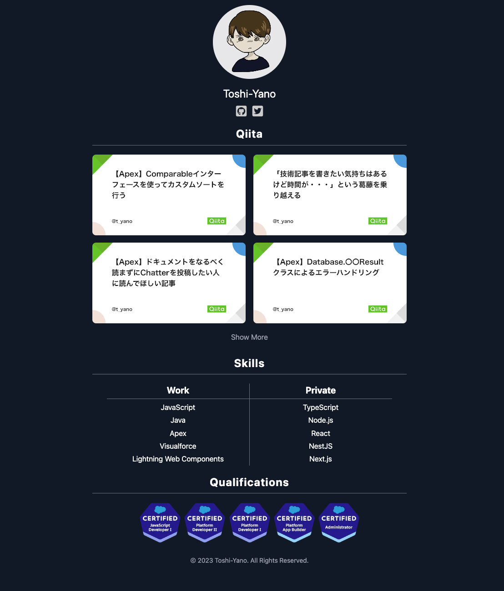
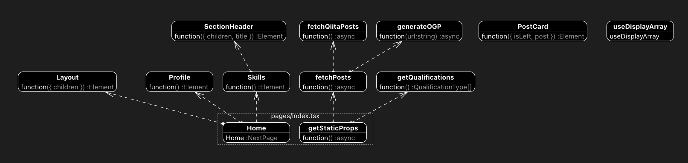
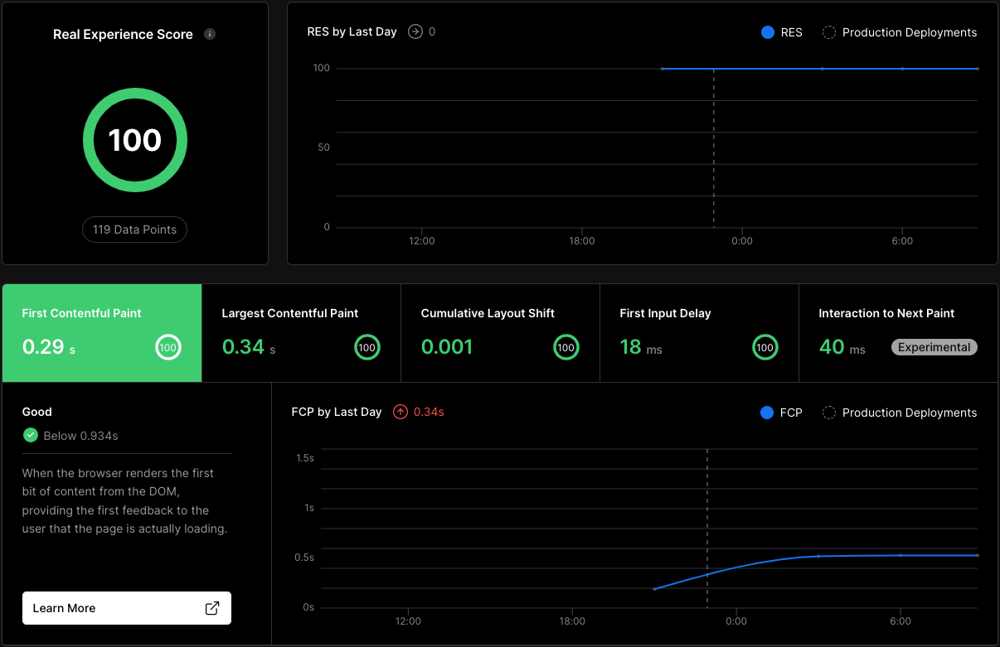

# portfolio

https://toshi-yano-portfolio.vercel.app/

# 使用技術
- TypeScript (v4.9)
- Next.js (v14 / Pages Router)
- React (v18.2)
- Node.js (v18)
- TailwindCSS
- Prettier
- ESLint
- husky
- GitHub Actions（APIによる投稿記事取得・画像読み出しをSSG化するために使用）
